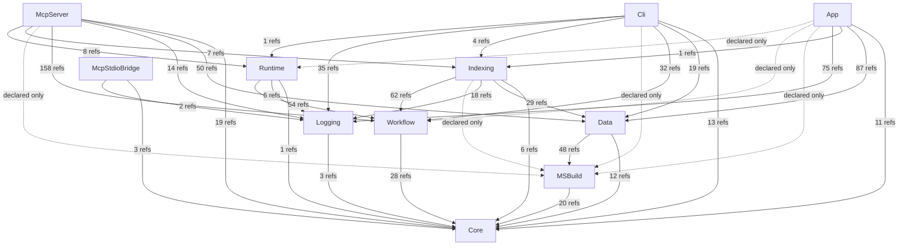

# AIMonitor Architecture (generated)

> Generated by dogfooding the AIMonitor MCP server DLL against AIMonitor's own self-index.
> **Skeleton** = `source-verified` (csproj ProjectReference, compiler-enforced). **Coupling weights** = `caller/index-verified` (live cross-project reference sites from the index).

## Index evidence

```json
{"repositoryRoot":"C:\\VSCodeProjects\\aimonitor-selfdoc","runtimeRoot":"C:\\VSCodeProjects\\aimonitor-selfdoc\\runtime-selfdoc","watchedSolutionPath":"C:\\VSCodeProjects\\AIMonitor\\AIMonitor.slnx","watchedProjectFolder":"C:\\VSCodeProjects\\AIMonitor","databasePath":"C:\\VSCodeProjects\\aimonitor-selfdoc\\runtime-selfdoc\\watched-solutions\\AIMonitor-7b45c38d3961\\data\\solution-index.sqlite","databaseExists":true,"projectCount":22,"documentCount":134,"symbolCount":2056,"referenceCount":8476,"callSiteCount":3808,"relationshipCount":7,"staleFileCount":0,"diagnosticCount":0}
```

## Layered architecture (foundation at bottom)



## Layers (topological rank from the csproj DAG)

- **rank 0** — Core
- **rank 1** — Logging, MSBuild, Workflow
- **rank 2** — Data, McpStdioBridge, Runtime
- **rank 3** — Indexing
- **rank 4** — App, Cli, McpServer

## Edge evidence (declared vs. live coupling)

| Consumer | Dependency | Declared (csproj) | Live refs (index) | Verdict |
|---|---|---|---|---|
| Logging | Core | yes | 3 | live (caller/index-verified) |
| MSBuild | Core | yes | 20 | live (caller/index-verified) |
| Workflow | Core | yes | 28 | live (caller/index-verified) |
| Data | Core | yes | 12 | live (caller/index-verified) |
| Data | MSBuild | yes | 48 | live (caller/index-verified) |
| Runtime | Core | yes | 1 | live (caller/index-verified) |
| Runtime | Logging | yes | 6 | live (caller/index-verified) |
| Runtime | Workflow | yes | 54 | live (caller/index-verified) |
| McpStdioBridge | Core | yes | 3 | live (caller/index-verified) |
| McpStdioBridge | Logging | yes | 2 | live (caller/index-verified) |
| Indexing | Core | yes | 6 | live (caller/index-verified) |
| Indexing | Data | yes | 29 | live (caller/index-verified) |
| Indexing | Logging | yes | 18 | live (caller/index-verified) |
| Indexing | MSBuild | yes | 0 | declared-only (no public ref — structural/transitive or candidate-dead) |
| Indexing | Workflow | yes | 62 | live (caller/index-verified) |
| App | Core | yes | 11 | live (caller/index-verified) |
| App | Data | yes | 87 | live (caller/index-verified) |
| App | Indexing | yes | 1 | live (caller/index-verified) |
| App | Logging | yes | 75 | live (caller/index-verified) |
| App | MSBuild | yes | 0 | declared-only (no public ref — structural/transitive or candidate-dead) |
| App | Workflow | yes | 0 | declared-only (no public ref — structural/transitive or candidate-dead) |
| App | Runtime | yes | 0 | declared-only (no public ref — structural/transitive or candidate-dead) |
| Cli | Core | yes | 13 | live (caller/index-verified) |
| Cli | Data | yes | 19 | live (caller/index-verified) |
| Cli | Workflow | yes | 32 | live (caller/index-verified) |
| Cli | MSBuild | yes | 0 | declared-only (no public ref — structural/transitive or candidate-dead) |
| Cli | Indexing | yes | 4 | live (caller/index-verified) |
| Cli | Logging | yes | 35 | live (caller/index-verified) |
| Cli | Runtime | yes | 1 | live (caller/index-verified) |
| McpServer | Core | yes | 19 | live (caller/index-verified) |
| McpServer | Data | yes | 50 | live (caller/index-verified) |
| McpServer | Logging | yes | 14 | live (caller/index-verified) |
| McpServer | Workflow | yes | 158 | live (caller/index-verified) |
| McpServer | MSBuild | yes | 0 | declared-only (no public ref — structural/transitive or candidate-dead) |
| McpServer | Indexing | yes | 7 | live (caller/index-verified) |
| McpServer | Runtime | yes | 8 | live (caller/index-verified) |

## Findings

- **6 declared ProjectReferences carry zero public cross-project references** — candidate-dead, or used only structurally/transitively (assembly-load-only, DI registration, `MSBuildLocator` init). Verify before removal: Indexing → MSBuild; App → MSBuild; App → Workflow; App → Runtime; Cli → MSBuild; McpServer → MSBuild.
- **relationshipCount = 7.** AIMonitor barely uses inheritance/interface relationships across the indexed surface — it is composition-over-inheritance; the architecture lives in the *reference* graph, not a type hierarchy.
- **Heaviest coupling** is McpServer→Workflow, App→Data, App→Logging — the orchestration/entry tier leans hardest on Workflow + Data.

## Evidence & caveats

- **Skeleton** (the DAG + ranks): `source-verified` — csproj `ProjectReference`, compiler-enforced; the build's acyclicity *proves* a valid layering exists.
- **Coupling weights**: `caller/index-verified` — live cross-project reference sites pulled from the self-index via the AIMonitor MCP server DLL.
- **Public-surface only:** coupling counts references whose *target* is a `Public` symbol. Cross-project use via `internal` + `InternalsVisibleTo` is **not** counted, so a `0` is *candidate*-dead, not proven-dead.
- **Reference-site semantics:** a dependency used only by assembly load / DI registration / config (no symbol reference) also shows `0` despite being needed at runtime.
- **Polarity:** rendered foundation-at-bottom (`flowchart TB`; `Core` is a sink). Tier *names* are not graph-derived — they are maintained intent.
- **Self-index, not live-watch:** AIMonitor cannot live-watch itself; it was indexed as a *target* solution to produce this. Regenerate-and-diff is stable (same index → byte-identical doc).

