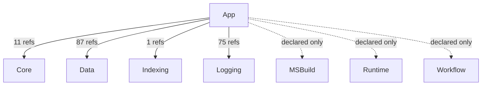
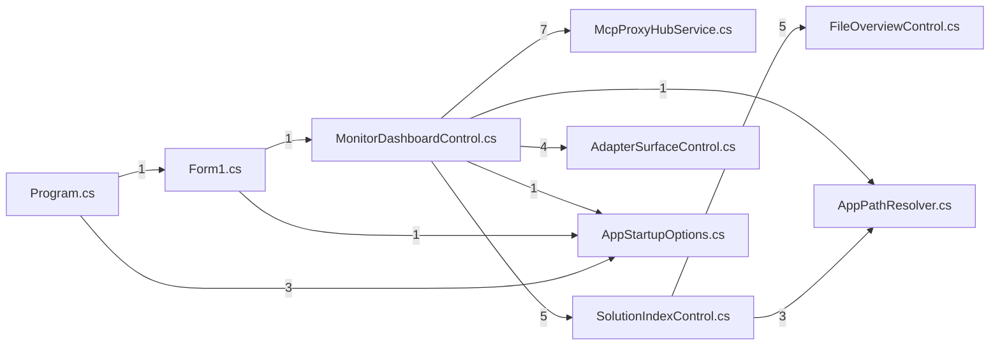

# AIMonitor.App — component architecture (generated)

> Generated from the solution index via the AIMonitor MCP server.
> **rank 4** in the solution layering. Solution-wide view: [`../Architecture.aim.md`](../Architecture.aim.md).

## Index evidence (project-scoped)

- **Files:** 11
- **Symbols:** 416 (public: 117)
- **Named types:** 35 across 2 namespace(s); public API surface: 10 type(s) + 107 public member(s)

## Place in the layering

### Depends on (outbound)

| Dependency | Live refs (index) | Verdict |
|---|---|---|
| Core | 11 | live (caller/index-verified) |
| Logging | 75 | live (caller/index-verified) |
| MSBuild | 0 | declared-only (no public ref — structural/transitive or candidate-dead) |
| Workflow | 0 | declared-only (no public ref — structural/transitive or candidate-dead) |
| Data | 87 | live (caller/index-verified) |
| Runtime | 0 | declared-only (no public ref — structural/transitive or candidate-dead) |
| Indexing | 1 | live (caller/index-verified) |

### Depended on by (inbound)

_None — top of the stack (no src project references this one)._

## Namespaces & types

- **AIMonitor.App**
  - `AppStartupOptions`
  - `Form1`
  - `HubHandshake` _private_
  - `McpProxyHubService`
  - `MessageMetadata` _private_
  - `PendingRequest` _private_
  - `Program` _internal_
- **AIMonitor.App.Controls**
  - `AdapterEventDetail` _private_
  - `AdapterEventView` _private_
  - `AdapterSurfaceControl`
  - `AppPathResolver` _internal_
  - `DependencyFolderNodeTag` _private_
  - `DetailProperty` _private_
  - `DetailPropertyBag` _private_
  - `DetailPropertyDescriptor` _private_
  - `DocumentNodeTag` _private_
  - `DocumentView` _private_
  - `FileOverviewControl`
  - `FilePropertyBag` _private_
  - `FolderNodeTag` _private_
  - `MonitorDashboardControl`
  - `PackageNodeTag` _private_
  - `ProjectNodeTag` _private_
  - `ProjectView` _private_
  - `ReferenceView`
  - `ReferenceView` _private_
  - `SelectionDetailsControl`
  - `SharedLogControl`
  - `SolutionIndexControl`
  - `SolutionNodeTag` _private_
  - `SourceReferenceGrouping` _private_
  - `SourceReferenceNodeTag` _private_
  - `SymbolNodeTag` _private_
  - `SymbolTreeTag` _private_
  - `SymbolView` _private_

## Public API surface (cross-project anchors)

10 public type(s) other projects can bind to:

- `AdapterSurfaceControl`
- `AppStartupOptions`
- `FileOverviewControl`
- `Form1`
- `McpProxyHubService`
- `MonitorDashboardControl`
- `ReferenceView`
- `SelectionDetailsControl`
- `SharedLogControl`
- `SolutionIndexControl`

## Internal coupling (public-surface, intra-project reference sites)

_11 intra-project edge(s). Edge `A --> B` = file A references a public symbol defined in file B._

## Caveats

- **Public-surface only:** coupling and internal edges are built from references whose *target* symbol is `Public`. Intra-project use through `internal`/`private` symbols is not probed, so the internal graph is a **partial** view (real cohesion is higher).
- **Reference-site semantics:** a file consumed only by assembly load / DI / config shows no edge despite a runtime relationship.
- **Self-index, not live-watch:** produced by indexing AIMonitor as a *target* solution. Regenerate-and-diff is stable (same index → byte-identical doc).

