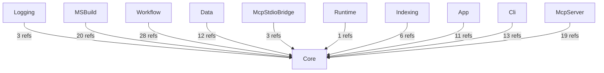
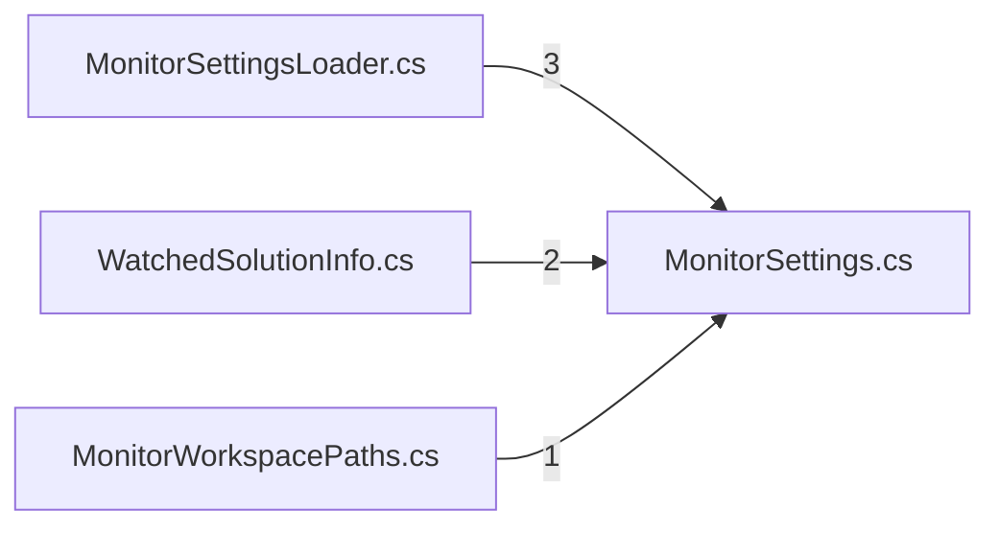

# AIMonitor.Core — component architecture (generated)

> Generated from the solution index via the AIMonitor MCP server.
> **rank 0** in the solution layering. Solution-wide view: [`../Architecture.aim.md`](../Architecture.aim.md).

## Index evidence (project-scoped)

- **Files:** 5
- **Symbols:** 32 (public: 17)
- **Named types:** 7 across 1 namespace(s); public API surface: 5 type(s) + 12 public member(s)

## Place in the layering

### Depends on (outbound)

_None — foundation project (rank 0)._

### Depended on by (inbound)

| Consumer | Live refs into this project | Verdict |
|---|---|---|
| Logging | 3 | live (caller/index-verified) |
| MSBuild | 20 | live (caller/index-verified) |
| Workflow | 28 | live (caller/index-verified) |
| Data | 12 | live (caller/index-verified) |
| McpStdioBridge | 3 | live (caller/index-verified) |
| Runtime | 1 | live (caller/index-verified) |
| Indexing | 6 | live (caller/index-verified) |
| App | 11 | live (caller/index-verified) |
| Cli | 13 | live (caller/index-verified) |
| McpServer | 19 | live (caller/index-verified) |

## Namespaces & types

- **AIMonitor.Core**
  - `LocalMonitorSettings` _private_
  - `LocalSettingsFile` _private_
  - `MonitorSettings`
  - `MonitorSettingsLoader`
  - `MonitorWorkspacePaths`
  - `StableIdentifier`
  - `WatchedSolutionInfo`

## Public API surface (cross-project anchors)

5 public type(s) other projects can bind to:

- `MonitorSettings`
- `MonitorSettingsLoader`
- `MonitorWorkspacePaths`
- `StableIdentifier`
- `WatchedSolutionInfo`

## Internal coupling (public-surface, intra-project reference sites)

_3 intra-project edge(s). Edge `A --> B` = file A references a public symbol defined in file B._

## Caveats

- **Public-surface only:** coupling and internal edges are built from references whose *target* symbol is `Public`. Intra-project use through `internal`/`private` symbols is not probed, so the internal graph is a **partial** view (real cohesion is higher).
- **Reference-site semantics:** a file consumed only by assembly load / DI / config shows no edge despite a runtime relationship.
- **Self-index, not live-watch:** produced by indexing AIMonitor as a *target* solution. Regenerate-and-diff is stable (same index → byte-identical doc).

