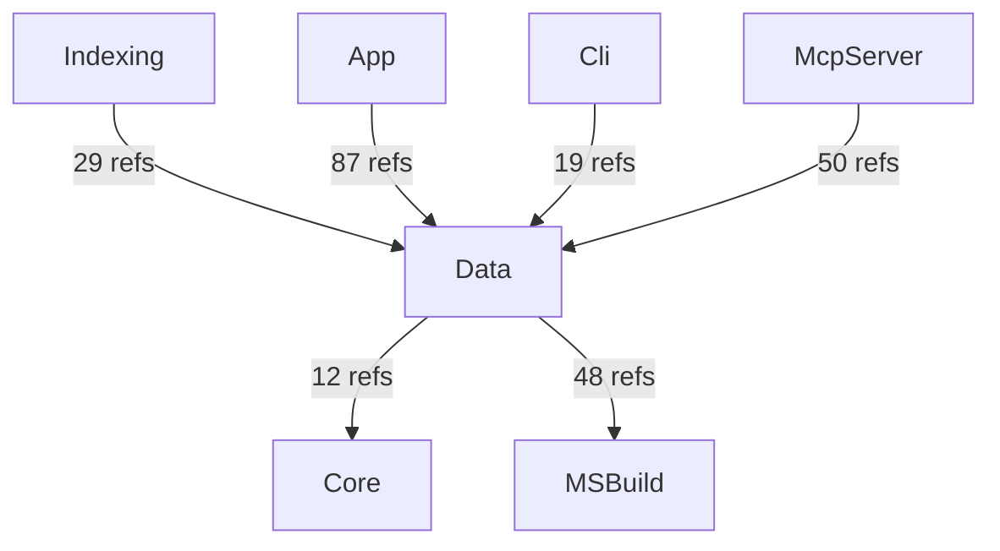
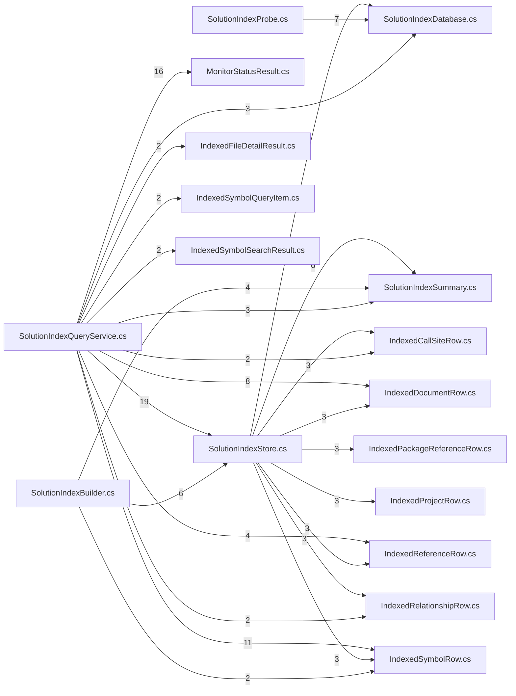

# AIMonitor.Data — component architecture (generated)

> Generated by dogfooding the AIMonitor MCP server DLL against AIMonitor's own self-index.
> **rank 2** in the solution layering. Solution-wide view: [`../Architecture.aim.md`](../Architecture.aim.md).

## Index evidence (project-scoped)

- **Files:** 19
- **Symbols:** 153 (public: 96)
- **Named types:** 21 across 1 namespace(s); public API surface: 21 type(s) + 75 public member(s)

## Place in the layering

### Depends on (outbound)

| Dependency | Live refs (index) | Verdict |
|---|---|---|
| Core | 12 | live (caller/index-verified) |
| MSBuild | 48 | live (caller/index-verified) |

### Depended on by (inbound)

| Consumer | Live refs into this project | Verdict |
|---|---|---|
| Indexing | 29 | live (caller/index-verified) |
| App | 87 | live (caller/index-verified) |
| Cli | 19 | live (caller/index-verified) |
| McpServer | 50 | live (caller/index-verified) |

## Namespaces & types

- **AIMonitor.Data**
  - `IndexedCallSiteRow`
  - `IndexedDocumentRow`
  - `IndexedFileDetailResult`
  - `IndexedPackageReferenceRow`
  - `IndexedProjectRow`
  - `IndexedReferenceRow`
  - `IndexedRelationshipRow`
  - `IndexedSymbolQueryItem`
  - `IndexedSymbolRow`
  - `IndexedSymbolSearchResult`
  - `MonitorDataPaths`
  - `MonitorStatusResult`
  - `ReferenceKindCount`
  - `SolutionIndexBuilder`
  - `SolutionIndexCounts`
  - `SolutionIndexDatabase`
  - `SolutionIndexProbe`
  - `SolutionIndexQueryResult`
  - `SolutionIndexQueryService`
  - `SolutionIndexStore`
  - `SolutionIndexSummary`

## Public API surface (cross-project anchors)

21 public type(s) other projects can bind to:

- `IndexedCallSiteRow`
- `IndexedDocumentRow`
- `IndexedFileDetailResult`
- `IndexedPackageReferenceRow`
- `IndexedProjectRow`
- `IndexedReferenceRow`
- `IndexedRelationshipRow`
- `IndexedSymbolQueryItem`
- `IndexedSymbolRow`
- `IndexedSymbolSearchResult`
- `MonitorDataPaths`
- `MonitorStatusResult`
- `ReferenceKindCount`
- `SolutionIndexBuilder`
- `SolutionIndexCounts`
- `SolutionIndexDatabase`
- `SolutionIndexProbe`
- `SolutionIndexQueryResult`
- `SolutionIndexQueryService`
- `SolutionIndexStore`
- `SolutionIndexSummary`

## Internal coupling (public-surface, intra-project reference sites)

_Showing the top 25 of 37 intra-project edges by weight. Edge `A --> B` = file A references a public symbol defined in file B._

## Caveats

- **Public-surface only:** coupling and internal edges are built from references whose *target* symbol is `Public`. Intra-project use through `internal`/`private` symbols is not probed, so the internal graph is a **partial** view (real cohesion is higher).
- **Reference-site semantics:** a file consumed only by assembly load / DI / config shows no edge despite a runtime relationship.
- **Self-index, not live-watch:** produced by indexing AIMonitor as a *target* solution. Regenerate-and-diff is stable (same index → byte-identical doc).

