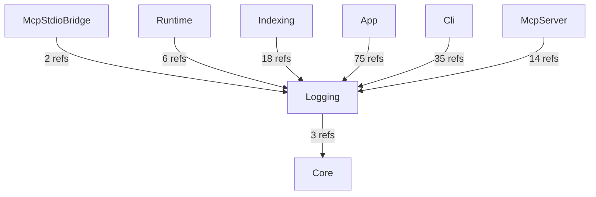
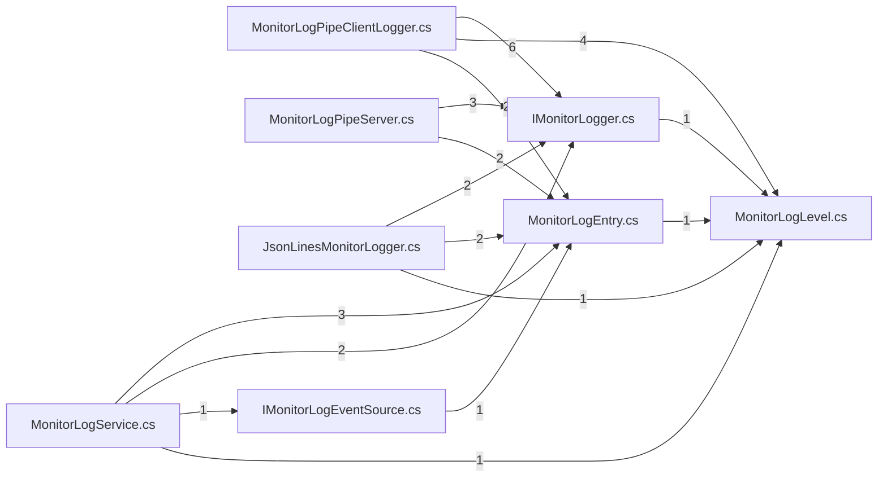

# AIMonitor.Logging — component architecture (generated)

> Generated by dogfooding the AIMonitor MCP server DLL against AIMonitor's own self-index.
> **rank 1** in the solution layering. Solution-wide view: [`../Architecture.aim.md`](../Architecture.aim.md).

## Index evidence (project-scoped)

- **Files:** 11
- **Symbols:** 58 (public: 36)
- **Named types:** 11 across 1 namespace(s); public API surface: 11 type(s) + 25 public member(s)

## Place in the layering

### Depends on (outbound)

| Dependency | Live refs (index) | Verdict |
|---|---|---|
| Core | 3 | live (caller/index-verified) |

### Depended on by (inbound)

| Consumer | Live refs into this project | Verdict |
|---|---|---|
| McpStdioBridge | 2 | live (caller/index-verified) |
| Runtime | 6 | live (caller/index-verified) |
| Indexing | 18 | live (caller/index-verified) |
| App | 75 | live (caller/index-verified) |
| Cli | 35 | live (caller/index-verified) |
| McpServer | 14 | live (caller/index-verified) |

## Namespaces & types

- **AIMonitor.Logging**
  - `IMonitorLogEventSource`
  - `IMonitorLogger`
  - `JsonLinesMonitorLogger`
  - `MonitorLogEntry`
  - `MonitorLogLevel`
  - `MonitorLogPaths`
  - `MonitorLogPipeClientLogger`
  - `MonitorLogPipeNames`
  - `MonitorLogPipeServer`
  - `MonitorLogService`
  - `MonitorMcpProxyPipeNames`

## Public API surface (cross-project anchors)

11 public type(s) other projects can bind to:

- `IMonitorLogEventSource`
- `IMonitorLogger`
- `JsonLinesMonitorLogger`
- `MonitorLogEntry`
- `MonitorLogLevel`
- `MonitorLogPaths`
- `MonitorLogPipeClientLogger`
- `MonitorLogPipeNames`
- `MonitorLogPipeServer`
- `MonitorLogService`
- `MonitorMcpProxyPipeNames`

## Internal coupling (public-surface, intra-project reference sites)

_15 intra-project edge(s). Edge `A --> B` = file A references a public symbol defined in file B._

## Caveats

- **Public-surface only:** coupling and internal edges are built from references whose *target* symbol is `Public`. Intra-project use through `internal`/`private` symbols is not probed, so the internal graph is a **partial** view (real cohesion is higher).
- **Reference-site semantics:** a file consumed only by assembly load / DI / config shows no edge despite a runtime relationship.
- **Self-index, not live-watch:** produced by indexing AIMonitor as a *target* solution. Regenerate-and-diff is stable (same index → byte-identical doc).

