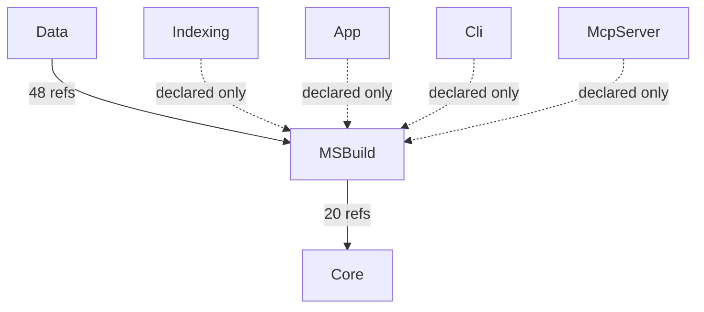

# AIMonitor.MSBuild — component architecture (generated)

> Generated from the solution index via the AIMonitor MCP server.
> **rank 1** in the solution layering. Solution-wide view: [`../Architecture.aim.md`](../Architecture.aim.md).

## Index evidence (project-scoped)

- **Files:** 1
- **Symbols:** 99 (public: 43)
- **Named types:** 14 across 1 namespace(s); public API surface: 11 type(s) + 32 public member(s)

## Place in the layering

### Depends on (outbound)

| Dependency | Live refs (index) | Verdict |
|---|---|---|
| Core | 20 | live (caller/index-verified) |

### Depended on by (inbound)

| Consumer | Live refs into this project | Verdict |
|---|---|---|
| Data | 48 | live (caller/index-verified) |
| Indexing | 0 | declared-only (no public ref — structural/transitive or candidate-dead) |
| App | 0 | declared-only (no public ref — structural/transitive or candidate-dead) |
| Cli | 0 | declared-only (no public ref — structural/transitive or candidate-dead) |
| McpServer | 0 | declared-only (no public ref — structural/transitive or candidate-dead) |

## Namespaces & types

- **AIMonitor.MSBuild**
  - `MSBuildDocumentSnapshot`
  - `MSBuildEvaluatedProject` _internal_
  - `MSBuildFrameworkReferenceSnapshot`
  - `MSBuildGlobalUsingSnapshot`
  - `MSBuildPackageReferenceSnapshot`
  - `MSBuildProjectFileSnapshot`
  - `MSBuildProjectReferenceSnapshot`
  - `MSBuildProjectSnapshot`
  - `MSBuildReferenceSnapshot`
  - `MSBuildSolutionSnapshot`
  - `MSBuildSymbolSnapshot`
  - `MSBuildWorkspaceLoader`
  - `ProjectSymbolIndex` _internal_
  - `RazorDocumentIndex` _internal_

## Public API surface (cross-project anchors)

11 public type(s) other projects can bind to:

- `MSBuildDocumentSnapshot`
- `MSBuildFrameworkReferenceSnapshot`
- `MSBuildGlobalUsingSnapshot`
- `MSBuildPackageReferenceSnapshot`
- `MSBuildProjectFileSnapshot`
- `MSBuildProjectReferenceSnapshot`
- `MSBuildProjectSnapshot`
- `MSBuildReferenceSnapshot`
- `MSBuildSolutionSnapshot`
- `MSBuildSymbolSnapshot`
- `MSBuildWorkspaceLoader`

## Internal coupling (public-surface, intra-project reference sites)

_No intra-project public-surface reference edges observed (single-file project, or internal cohesion flows through non-public symbols)._

## Caveats

- **Public-surface only:** coupling and internal edges are built from references whose *target* symbol is `Public`. Intra-project use through `internal`/`private` symbols is not probed, so the internal graph is a **partial** view (real cohesion is higher).
- **Reference-site semantics:** a file consumed only by assembly load / DI / config shows no edge despite a runtime relationship.
- **Self-index, not live-watch:** produced by indexing AIMonitor as a *target* solution. Regenerate-and-diff is stable (same index → byte-identical doc).

