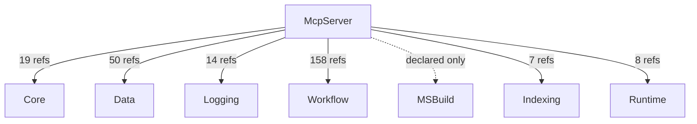

# AIMonitor.McpServer — component architecture (generated)

> Generated by dogfooding the AIMonitor MCP server DLL against AIMonitor's own self-index.
> **rank 4** in the solution layering. Solution-wide view: [`../Architecture.aim.md`](../Architecture.aim.md).

## Index evidence (project-scoped)

- **Files:** 1
- **Symbols:** 182 (public: 131)
- **Named types:** 33 across 1 namespace(s); public API surface: 32 type(s) + 99 public member(s)

## Place in the layering

### Depends on (outbound)

| Dependency | Live refs (index) | Verdict |
|---|---|---|
| Core | 19 | live (caller/index-verified) |
| Logging | 14 | live (caller/index-verified) |
| MSBuild | 0 | declared-only (no public ref — structural/transitive or candidate-dead) |
| Workflow | 158 | live (caller/index-verified) |
| Data | 50 | live (caller/index-verified) |
| Runtime | 8 | live (caller/index-verified) |
| Indexing | 7 | live (caller/index-verified) |

### Depended on by (inbound)

_None — top of the stack (no src project references this one)._

## Namespaces & types

- **AIMonitor.McpServer**
  - `AIMonitorCompatibilityResult`
  - `AIMonitorFileHashCheckResult`
  - `AIMonitorFileHashInfo`
  - `AIMonitorFileMatch`
  - `AIMonitorFileReadResult`
  - `AIMonitorGuardrailCheck`
  - `AIMonitorIndexedReferenceResult`
  - `AIMonitorLedgerInfo`
  - `AIMonitorLedgerReadResult`
  - `AIMonitorMcpRuntimeState`
  - `AIMonitorMcpStatus`
  - `AIMonitorNamespaceTree`
  - `AIMonitorRefreshFileAndIndexResult`
  - `AIMonitorRefreshIndexFileResult`
  - `AIMonitorRefreshIndexResult`
  - `AIMonitorSelfCheckResult`
  - `AIMonitorServerShutdownResult`
  - `AIMonitorSessionEditPlan`
  - `AIMonitorSessionEvent`
  - `AIMonitorSessionFileAccess`
  - `AIMonitorSessionPlannedFile`
  - `AIMonitorSessionPlannedFileInput`
  - `AIMonitorSessionState`
  - `AIMonitorSessionSummary`
  - `AIMonitorSolutionIndexTree`
  - `AIMonitorStageCandidateResult`
  - `AIMonitorStagedDiffLaunchResult`
  - `AIMonitorToolErrorResult`
  - `AIMonitorTools`
  - `AIMonitorWatchedProjectInfo`
  - `AIMonitorWorkflowStatus`
  - `PlannedSessionDecisionOptions`
  - `Program` _internal_

## Public API surface (cross-project anchors)

32 public type(s) other projects can bind to:

- `AIMonitorCompatibilityResult`
- `AIMonitorFileHashCheckResult`
- `AIMonitorFileHashInfo`
- `AIMonitorFileMatch`
- `AIMonitorFileReadResult`
- `AIMonitorGuardrailCheck`
- `AIMonitorIndexedReferenceResult`
- `AIMonitorLedgerInfo`
- `AIMonitorLedgerReadResult`
- `AIMonitorMcpRuntimeState`
- `AIMonitorMcpStatus`
- `AIMonitorNamespaceTree`
- `AIMonitorRefreshFileAndIndexResult`
- `AIMonitorRefreshIndexFileResult`
- `AIMonitorRefreshIndexResult`
- `AIMonitorSelfCheckResult`
- `AIMonitorServerShutdownResult`
- `AIMonitorSessionEditPlan`
- `AIMonitorSessionEvent`
- `AIMonitorSessionFileAccess`
- `AIMonitorSessionPlannedFile`
- `AIMonitorSessionPlannedFileInput`
- `AIMonitorSessionState`
- `AIMonitorSessionSummary`
- `AIMonitorSolutionIndexTree`
- `AIMonitorStageCandidateResult`
- `AIMonitorStagedDiffLaunchResult`
- `AIMonitorToolErrorResult`
- `AIMonitorTools`
- `AIMonitorWatchedProjectInfo`
- `AIMonitorWorkflowStatus`
- `PlannedSessionDecisionOptions`

## Internal coupling (public-surface, intra-project reference sites)

_No intra-project public-surface reference edges observed (single-file project, or internal cohesion flows through non-public symbols)._

## Caveats

- **Public-surface only:** coupling and internal edges are built from references whose *target* symbol is `Public`. Intra-project use through `internal`/`private` symbols is not probed, so the internal graph is a **partial** view (real cohesion is higher).
- **Reference-site semantics:** a file consumed only by assembly load / DI / config shows no edge despite a runtime relationship.
- **Self-index, not live-watch:** produced by indexing AIMonitor as a *target* solution. Regenerate-and-diff is stable (same index → byte-identical doc).

