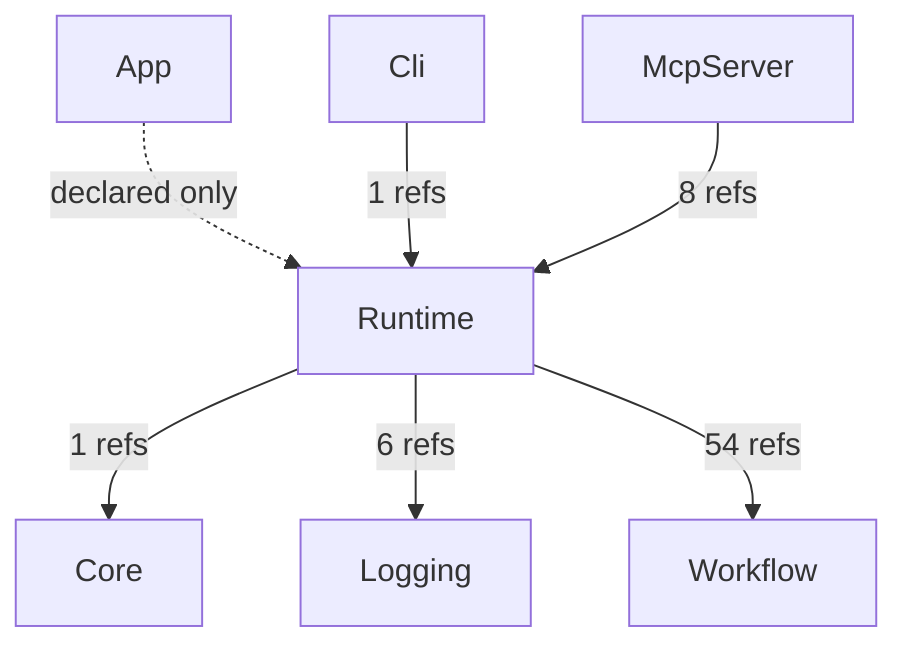
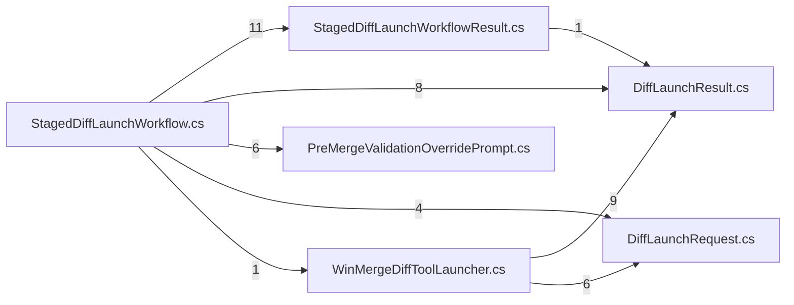

# AIMonitor.Runtime — component architecture (generated)

> Generated from the solution index via the AIMonitor MCP server.
> **rank 2** in the solution layering. Solution-wide view: [`../Architecture.aim.md`](../Architecture.aim.md).

## Index evidence (project-scoped)

- **Files:** 7
- **Symbols:** 72 (public: 52)
- **Named types:** 9 across 1 namespace(s); public API surface: 7 type(s) + 45 public member(s)

## Place in the layering

### Depends on (outbound)

| Dependency | Live refs (index) | Verdict |
|---|---|---|
| Core | 1 | live (caller/index-verified) |
| Logging | 6 | live (caller/index-verified) |
| Workflow | 54 | live (caller/index-verified) |

### Depended on by (inbound)

| Consumer | Live refs into this project | Verdict |
|---|---|---|
| App | 0 | declared-only (no public ref — structural/transitive or candidate-dead) |
| Cli | 1 | live (caller/index-verified) |
| McpServer | 8 | live (caller/index-verified) |

## Namespaces & types

- **AIMonitor.Runtime**
  - `DiffLaunchRequest`
  - `DiffLaunchResult`
  - `PreMergeValidationOverridePrompt`
  - `RuntimeBoundary`
  - `StagedDiffLaunchWorkflow`
  - `StagedDiffLaunchWorkflowResult`
  - `TaskDialogButton` _private_
  - `TaskDialogConfig` _private_
  - `WinMergeDiffToolLauncher`

## Public API surface (cross-project anchors)

7 public type(s) other projects can bind to:

- `DiffLaunchRequest`
- `DiffLaunchResult`
- `PreMergeValidationOverridePrompt`
- `RuntimeBoundary`
- `StagedDiffLaunchWorkflow`
- `StagedDiffLaunchWorkflowResult`
- `WinMergeDiffToolLauncher`

## Internal coupling (public-surface, intra-project reference sites)

_8 intra-project edge(s). Edge `A --> B` = file A references a public symbol defined in file B._

## Caveats

- **Public-surface only:** coupling and internal edges are built from references whose *target* symbol is `Public`. Intra-project use through `internal`/`private` symbols is not probed, so the internal graph is a **partial** view (real cohesion is higher).
- **Reference-site semantics:** a file consumed only by assembly load / DI / config shows no edge despite a runtime relationship.
- **Self-index, not live-watch:** produced by indexing AIMonitor as a *target* solution. Regenerate-and-diff is stable (same index → byte-identical doc).

