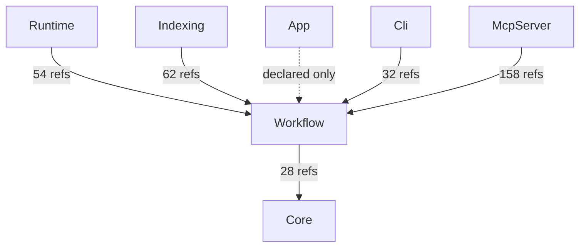
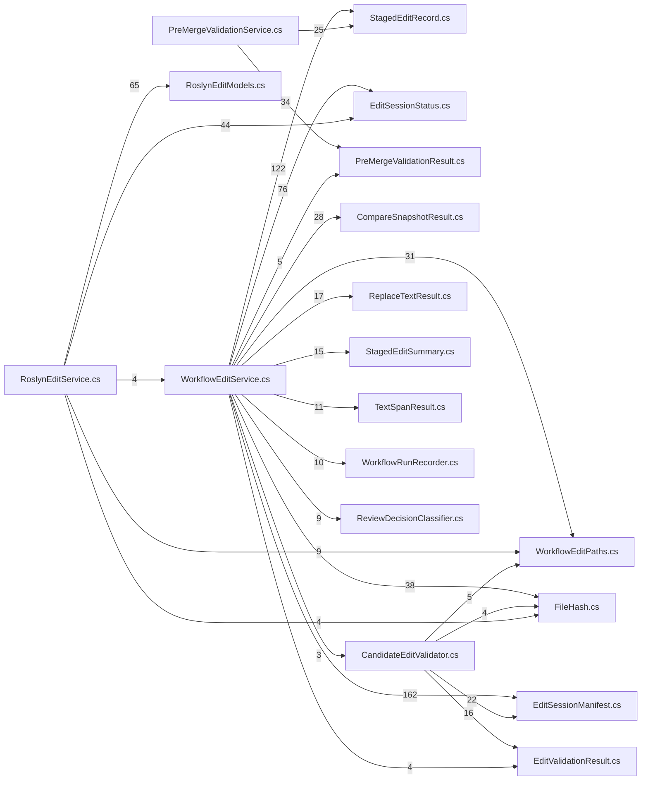

# AIMonitor.Workflow — component architecture (generated)

> Generated from the solution index via the AIMonitor MCP server.
> **rank 1** in the solution layering. Solution-wide view: [`../Architecture.aim.md`](../Architecture.aim.md).

## Index evidence (project-scoped)

- **Files:** 19
- **Symbols:** 415 (public: 263)
- **Named types:** 39 across 1 namespace(s); public API surface: 34 type(s) + 229 public member(s)

## Place in the layering

### Depends on (outbound)

| Dependency | Live refs (index) | Verdict |
|---|---|---|
| Core | 28 | live (caller/index-verified) |

### Depended on by (inbound)

| Consumer | Live refs into this project | Verdict |
|---|---|---|
| Runtime | 54 | live (caller/index-verified) |
| Indexing | 62 | live (caller/index-verified) |
| App | 0 | declared-only (no public ref — structural/transitive or candidate-dead) |
| Cli | 32 | live (caller/index-verified) |
| McpServer | 158 | live (caller/index-verified) |

## Namespaces & types

- **AIMonitor.Workflow**
  - `CandidateEditValidator` _internal_
  - `CompareSnapshotResult`
  - `EditOverlayDiagnostic`
  - `EditOverlayValidationResult`
  - `EditSessionManifest`
  - `EditSessionStatus`
  - `EditSyntaxDiagnostic`
  - `EditSyntaxValidationResult`
  - `ExternalValidationInputs` _private_
  - `FileHash`
  - `FileLedgerWriter`
  - `ManifestLock` _private_
  - `PreMergeValidationResult`
  - `PreMergeValidationService`
  - `ProcessResult` _private_
  - `ReplaceTextResult`
  - `ReviewDecisionClassifier`
  - `ReviewDecisionInput`
  - `ReviewDecisionResult`
  - `RoslynEditResult`
  - `RoslynEditService`
  - `RoslynFileOutlineItem`
  - `RoslynFileOutlineResult`
  - `RoslynSourceMapAttribute`
  - `RoslynSourceMapDiagnostic`
  - `RoslynSourceMapFile`
  - `RoslynSourceMapNarrowingSuggestion`
  - `RoslynSourceMapNextCall`
  - `RoslynSourceMapResult`
  - `RoslynSourceMapSymbol`
  - `RoslynSymbolReadResult`
  - `RoslynSymbolSelector`
  - `StagedEditRecord`
  - `StagedEditSummary`
  - `TextPosition` _private_
  - `TextSpanResult`
  - `WorkflowEditPaths`
  - `WorkflowEditService`
  - `WorkflowRunRecorder`

## Public API surface (cross-project anchors)

34 public type(s) other projects can bind to:

- `CompareSnapshotResult`
- `EditOverlayDiagnostic`
- `EditOverlayValidationResult`
- `EditSessionManifest`
- `EditSessionStatus`
- `EditSyntaxDiagnostic`
- `EditSyntaxValidationResult`
- `FileHash`
- `FileLedgerWriter`
- `PreMergeValidationResult`
- `PreMergeValidationService`
- `ReplaceTextResult`
- `ReviewDecisionClassifier`
- `ReviewDecisionInput`
- `ReviewDecisionResult`
- `RoslynEditResult`
- `RoslynEditService`
- `RoslynFileOutlineItem`
- `RoslynFileOutlineResult`
- `RoslynSourceMapAttribute`
- `RoslynSourceMapDiagnostic`
- `RoslynSourceMapFile`
- `RoslynSourceMapNarrowingSuggestion`
- `RoslynSourceMapNextCall`
- `RoslynSourceMapResult`
- `RoslynSourceMapSymbol`
- `RoslynSymbolReadResult`
- `RoslynSymbolSelector`
- `StagedEditRecord`
- `StagedEditSummary`
- `TextSpanResult`
- `WorkflowEditPaths`
- `WorkflowEditService`
- `WorkflowRunRecorder`

## Internal coupling (public-surface, intra-project reference sites)

_Showing the top 25 of 31 intra-project edges by weight. Edge `A --> B` = file A references a public symbol defined in file B._

## Caveats

- **Public-surface only:** coupling and internal edges are built from references whose *target* symbol is `Public`. Intra-project use through `internal`/`private` symbols is not probed, so the internal graph is a **partial** view (real cohesion is higher).
- **Reference-site semantics:** a file consumed only by assembly load / DI / config shows no edge despite a runtime relationship.
- **Self-index, not live-watch:** produced by indexing AIMonitor as a *target* solution. Regenerate-and-diff is stable (same index → byte-identical doc).

